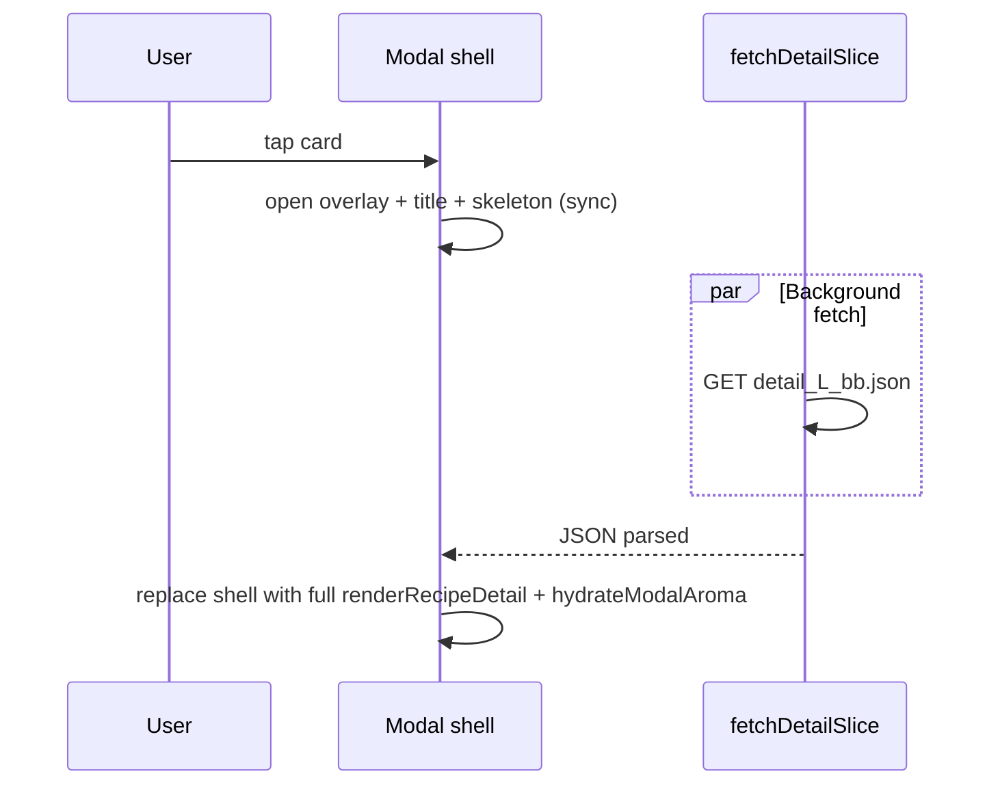

# Kitchen modal: optimistic shell + optional slice cache

## Goal

Deliver the **elegant, low-complexity** fix discussed with the user:

1. **Perceived latency**: user sees the modal **immediately** with **recipe title** (and optional meta) while the **detail sub-shard** loads.
2. **Actual latency**: unchanged on first cold fetch (~network + `JSON.parse`), but the UI no longer blocks on a blank page or generic loader-only state.
3. **Repeat visits**: optional **Service Worker** caches `recipe_detail/detail_*_*.json` so second opens on the same device are fast offline/Wi‑Fi.

**Explicitly out of scope:** rewriting the stack (React/Next), embedding full detail in index shards, or removing sub-shards.

## Current behaviour (problem)

In `[index.html](index.html)`, `openRecipe` sets `modal.innerHTML` to a **full-page “Loading recipe…”** state, then `**await fetchDetailSlice`**, then replaces with `renderRecipeDetail`. Until the await resolves, the user sees **no title** and **no sense of progress** beyond a spinner—on a slow tablet link this reads as “broken for several seconds.”

## Target behaviour

## Implementation

### 1. Optimistic shell in `openRecipe` (required)

**Catalog path only** (same structure as today; user recipes can stay instant—they already skip fetch).

- **Immediately**: `document.body.style.overflow = 'hidden'`, add `open` on `#modalOverlay`.
- **Sync first paint**: build a **small HTML string** for:
  - modal top bar (close + wake pill if present today—match `renderRecipeDetail` header for consistency)
  - **title**: `KuschiRecipeUi.esc(info.name)` from `recipeIndex[id]` (always set for catalog rows after `buildRecipeIndex`).
  - optional one-line subtitle: e.g. “Loading ingredients & method…”
  - **skeleton**: a few placeholder rows (CSS-only blocks using existing theme vars, e.g. `var(--surface2)`) for ingredients/method—no new assets required.
- **Then**: `await fetchDetailSlice` → `findRecipeInDetailPayload` → on success assign `currentRecipe`, set `modal.innerHTML = renderRecipeDetail(recipe)`, `hydrateModalAroma`, scroll top, wake sync.
- **On error**: keep overlay open; replace shell body with the **same error UI** as today (`Could not load recipe: …`) so behaviour matches current `catch`.

**Edge cases**

- Missing `recipeIndex[id]`: keep current throw path (or show error shell without title).
- `**copyRecipeText` / `currentRecipe`**: until fetch completes, `currentRecipe` may be null or stale; ensure copy actions either no-op or wait—today modal copy uses `currentRecipe` after load; **do not** set `currentRecipe` to a partial shell object.

### 2. Title parity (recommended)

`recipeIndex[id].name` should match list/card text because both come from compact index. If any code path shows a different title on the card, add `**data-recipe-name`** on `.card` in the card template and read it in `openRecipe` for the shell title (escaped). Prefer **one source of truth** to avoid drift.

### 3. Optional Service Worker (phase 2)

- Add `[sw.js](sw.js)` at repo root (same directory as `index.html` for GitHub Pages project sites).
- **Install**: `self.skipWaiting` + `clients.claim` optional—document tradeoff (immediate control vs in-flight tabs).
- **Fetch handler**: on `GET` for URLs under `recipe_detail/` matching `detail_*_*.json` (and optionally `detail_[A-Z].json` for legacy), use **cache-first or stale-while-revalidate**:
  - **cache-first**: fastest repeat; bump cache version when deploying new JSON.
- **Register** from `index.html` after load: `navigator.serviceWorker.register` with `siteBaseUrl() + '/sw.js'` (respect subdirectory deploys like `/recipelibrary/`).
- **Scope**: must not break `file://` local testing—register only when `location.protocol === 'https:'` or `localhost`.

If SW is skipped in v1, the optimistic shell alone still ships value.

### 4. Prefetch

No change **required**—existing `schedulePrefetchVisibleDetailShards` / pointer prefetch already help. After shell lands, measure with `?kuschiPerfModal=1`; only then tune idle prefetch (e.g. more cards, sooner).

## Verification

- **Desktop**: throttle network to Slow 3G; tap recipe—modal should open **with title** under ~100 ms.
- **Repeat**: second open same recipe (with SW if implemented) should show full content quickly.
- `**kuschiPerfModal=1`**: log slice ms vs total; total perceived “time to title” should be ~0.

## Risks / notes

- **FOUC**: skeleton must use existing CSS variables so it matches dark theme.
- **SW debugging**: users may need one hard refresh after deploy when cache version changes; document in README one line if SW ships.
- **GitHub Pages**: `sw.js` path must match site base (already solved by `siteBaseUrl()` pattern).

## Implementation order

1. Optimistic shell + error handling in `openRecipe` (catalog branch).
2. Optional `data-recipe-name` on cards if parity review finds gaps.
3. Optional `sw.js` + registration.
4. README or kitchen-library SKILL: one sentence on “modal opens immediately; detail loads async; optional offline cache for slices.”

