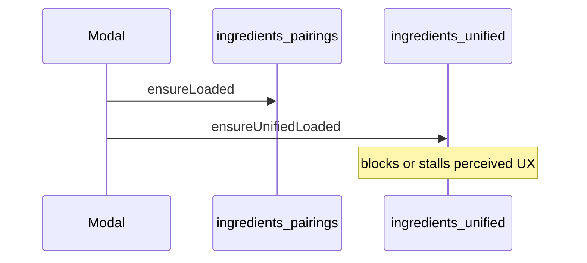

# Recipe modal: fast loading, no stuck spinner — keep all tips

## Product intent

- **Keep** seasoning suggestions, flavour notes, and pairing-style tips in the modal.
- **Prioritise** fast first paint and **never** leaving the user on a dead “Loading…” state (slow network, failed fetch, huge JSON parse).

## Why it feels slow / stuck today

Same as before: [`appendFlavorExtras`](assets/aroma-hints.js) runs from [`fillHintWrap`](assets/aroma-hints.js) after aroma loads and pulls [**~1.9MB** `combined_data/ingredients_unified.json`](combined_data/ingredients_unified.json). That blocks the “full” seasoning block and can feel like a hang on GitHub Pages or mobile.

There is no **timeout** today: a stalled fetch can leave **“Loading seasoning ideas…”** or flavour loading text indefinitely.

## Performance + reliability plan

1. **Lazy unified (required)**  
   - Do **not** call `appendFlavorExtras` / `ensureUnifiedLoaded` from the initial `fillHintWrap` path.  
   - Main **seasoning chips** (from `ensureLoaded` + `buildSuggestions`) appear as soon as the small aroma JSON pair is ready.  
   - Add a **second `
`**, closed by default: e.g. **“More flavour & pairing notes”** — on first open, run `ensureUnifiedLoaded()` once (`data-kuschi-flavor-hydrated`), then inject `buildFlavorExtrasHtml` + wire pivot. If that fails or times out, show a **short error + link to flavor.html** and clear loading state.

2. **Anti-stuck (required)**  
   - Wrap critical fetches (`ensureLoaded`, `ensureUnifiedLoaded`) with **`AbortController` + timeout** (e.g. 12–20s for unified, shorter for aroma) or `Promise.race` against a reject timer.  
   - In **`catch` / `finally`**: always replace loading nodes with either content or **actionable fallback** (“Couldn’t load flavour data — try again” / link).  
   - Ensure **`fillHintWrap`** `.catch` removes **“Loading seasoning ideas…”** and shows the same failure pattern as today but **guaranteed**.

3. **Prefetch aroma only (required)**  
   - After index catalog load, `requestIdleCallback` → `KuschiAromaHints.ensureLoaded()` so first tap often skips the 200KB cold start.

4. **Modal defaults**  
   - [`seasoningSectionHtml`](assets/aroma-hints.js) / [`index.html`](index.html): **`openByDefault: false`** so the modal opens on recipe body first; expanding hints is explicit (also avoids feeling “stuck” above the fold).

5. **Chef-friendly copy (optional same PR)**  
   - Shorter titles, no raw JSON in `<pre>`, plain lists for pivot — **only if** bundled without delaying the lazy + timeout work.

## Out of scope

- Removing seasoning / flavour / pairing tips from the modal.  
- Rewriting `recipe_detail` shard strategy (unless a separate perf project).
